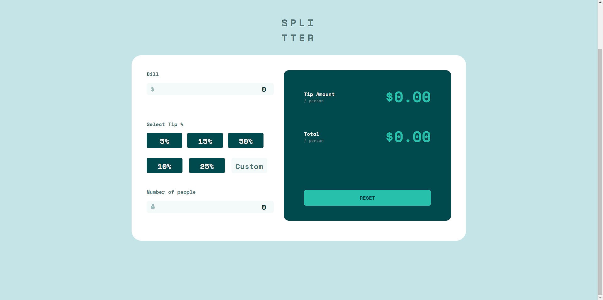
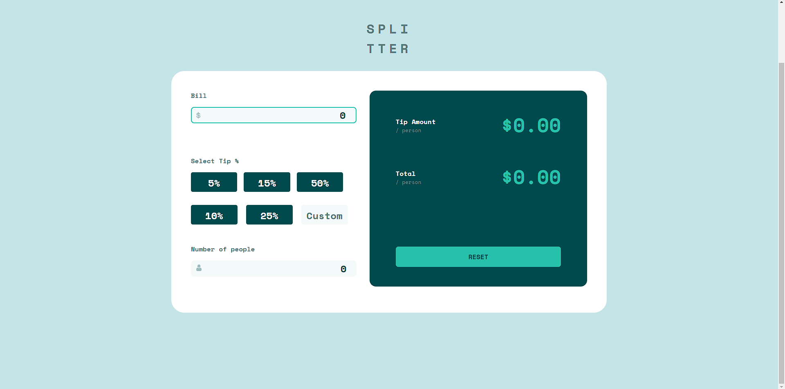
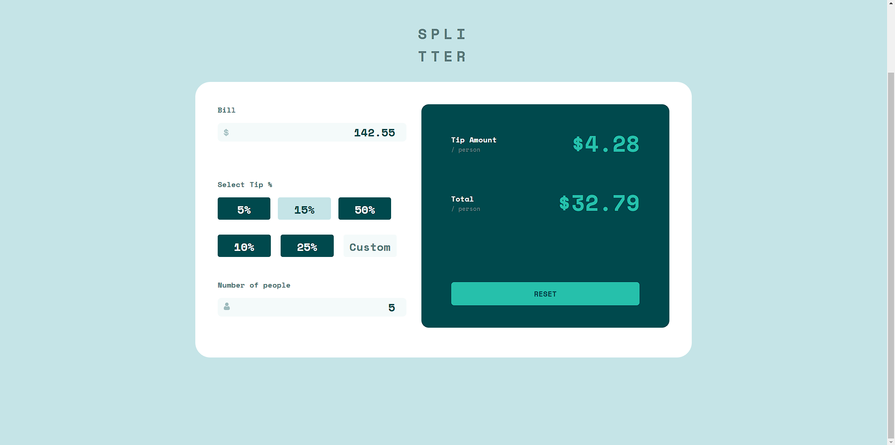
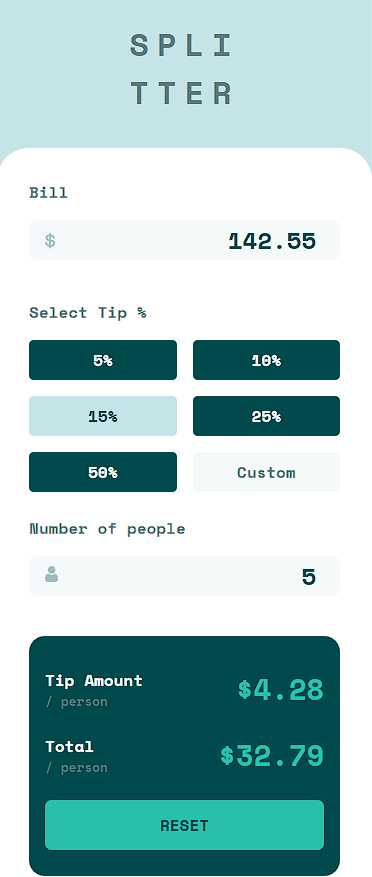

# Tip Calculator App
 

# About

Tip Calculator developed using React.

### Access the app: https://your-tip-calculator.netlify.app/
 

## Desktop

 

 

 

## Mobile

 

## How to download and install ⚙️🖥️
 

#### git clone 🔽

<pre>
git clone git@github.com:martsDev/tip-calculator-app.git
</pre>

 

### Access tip-calculator-app directory 📂

<pre>
cd tip-calculator-app
</pre>

 

### Install the dependencies 🔧

<pre>
npm install
</pre>

 

### Run the project! ▶️

<pre>
npm start
</pre>

 

Developed by Lucas
